# Operator guide: enrolling a device and touring the admin UI

This guide walks through two things at a terminal and in a browser: adding
a device's certificate identity to a running server, and a tour of every
card on the admin dashboard. It assumes the admin listener is already
reachable the way [`admin.md`](admin.md) describes; this guide does not
repeat that setup, only points to it where needed.

Everything below was run against a loopback, test-only server. None of the
certificates, keys, or identifiers shown are tied to any real device or
deployment.

## Part 1: Adding a client certificate

### Before you start

You need:

- A built server binary: `go build -o sep2server ./cmd/sep2server`.
- A place to put certificate material: an empty `certs/` directory next to
  the binary.
- The admin listener reachable in a browser. The rest of this walkthrough
  uses the plain-HTTP loopback default described in `admin.md`'s
  [Reaching the admin surface](admin.md#reaching-the-admin-surface)
  section: `http://127.0.0.1:8444/`, admitted with no login step by the
  `#246` loopback bypass. If you already run the admin listener behind
  TLS or a login, everything past "enroll the device" still applies; only
  the URL and the login step change. If a reverse proxy fronts this same
  host, the loopback bypass admits any relayed request unless the proxy
  injects `X-Forwarded-For`; see admin-listener.md's
  [Reverse-proxy XFF requirement](admin-listener.md#reverse-proxy-xff-requirement-269).

Two different certificate mechanisms live in this server, and this guide
covers only the first one:

- **Device identity (SFDI/LFDI).** Computed from a certificate's raw bytes.
  This is what identifies an IEEE 2030.5 client device to the server, and
  it is what "adding a client certificate" means below.
- **Admin plane authorization.** A separate check, on a separate
  certificate, gating access to the admin UI itself. It has nothing to do
  with SFDI or LFDI. See [Known limitations](#known-limitations) for its
  current gap.

Keep the two apart as you read: nothing in Part 1 touches admin
authorization.

### Generate a test CA and a device certificate

```bash
./sep2server certs generate-ca -out ./certs -cn "Test Root CA"
./sep2server certs generate-server -ca ./certs/ca.crt -ca-key ./certs/ca.key \
  -hosts "localhost,127.0.0.1" -out ./certs
./sep2server certs generate-device -ca ./certs/ca.crt -ca-key ./certs/ca.key \
  -hw-serial "TESTDEV0001" -hw-type "1.3.6.1.4.1.40732.99" -name device -out ./certs
```

The first command produces a root CA (`ca.crt` / `ca.key`) that signs
everything else. The second produces the server's own TLS leaf
(`server.crt` / `server.key`) for the protocol listener; the server picks
these up from `certs/` by default, so you do not need to set `SEP2_CERT`,
`SEP2_KEY`, or `SEP2_CA` explicitly if you generated into `./certs` as
shown. The third produces the device certificate (`device.crt` /
`device.key`) you will enroll below. `-hw-serial` and `-hw-type` are not
cosmetic: they are the CSIP `HardwareModuleName` fields the device
certificate's Subject Alternative Name carries in place of a Subject CN,
which is why the parsed certificate shows an empty Subject in the next
section. `make certs` (documented in `admin.md`'s
[mTLS cert flow](admin.md#mtls-cert-flow-for-the-admin-path) section) runs
these same subcommands for you if you want the full four-artifact set
instead of generating by hand.

### What LFDI and SFDI are

Every certificate the server issues or accepts has two derived
identifiers, computed the same way everywhere a certificate is generated
or parsed. Both come from one number: the SHA-256 fingerprint of the
certificate's entire DER-encoded bytes (IEEE Std 2030.5-2018 section
6.3.2).

- **LFDI** (Long-Form Device Identifier): the fingerprint's first 160 bits
  (20 bytes), written as 40 uppercase hex characters (section 6.3.4).
- **SFDI** (Short-Form Device Identifier): the fingerprint's first 36
  bits, written as 11 decimal digits, with a sum-of-digits check digit
  appended (section 6.3.3).

Neither identifier is stored anywhere on the certificate itself; both are
recomputed from the certificate's bytes every time they are needed. This
is why pasting the same certificate into the admin UI always produces the
same SFDI and LFDI: they are a function of the certificate, not a field
inside it.

### Enroll the device through the admin UI

Open the **Add End Device** card and paste the PEM contents of
`certs/device.crt` into the text area.

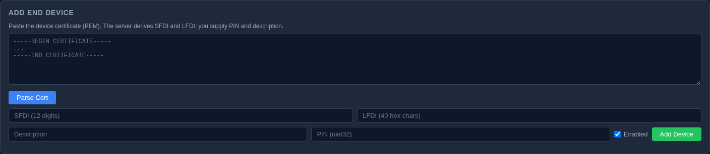

Click **Parse Cert**. The SFDI and LFDI fields fill in automatically, and
the result line reports what was parsed:

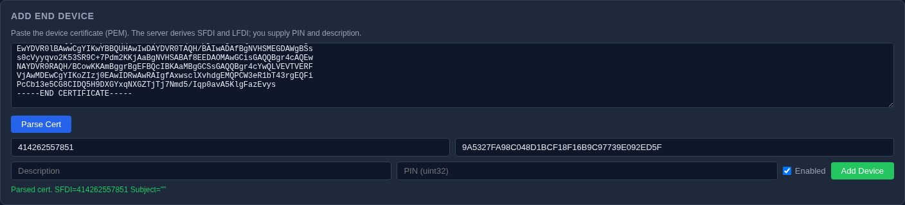

For the certificate generated above, this reads
`Parsed cert. SFDI=414262557851 Subject=""`. The empty Subject is expected
for exactly the reason described above: a CSIP device certificate carries
its identity in the SAN, not the Subject CN.

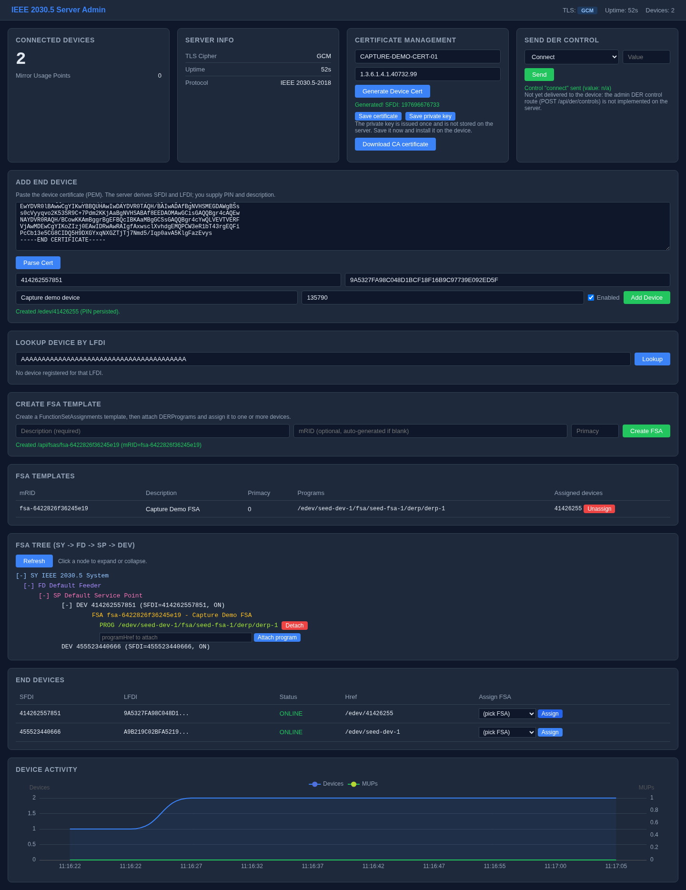

Fill in a nickname and a PIN, leave the device enabled, and click
**Add Device**. This calls `POST /api/devices`, which creates the
EndDevice and a Registration record keyed to the PIN you entered. The
device you just added is now registered under an endpoint that echoes its
SFDI, for example `/edev/41426255`.

### Verify: an accepted lookup and a rejected one

Open **Lookup Device by LFDI** and type in the LFDI you just saw fill in
above, then click **Lookup**.


The result line reads `Found: /edev/41426255 SFDI=414262557851
enabled=true`: the device you registered is there.

Now type an LFDI that was never registered, for example 40 repeated
characters such as `AAAAAAAAAAAAAAAAAAAAAAAAAAAAAAAAAAAAAAAA`, and click
**Lookup** again.


The result line reads `No device registered for that LFDI.` This is the
negative case: the same lookup path, run against an LFDI the store has
never seen, returns a plain miss rather than an error. Running both
directions is the actual proof that enrollment did something: an
enrollment step that only shows a success message, with nothing to check
it against, has not been verified.

## Part 2: The admin UI, section by section

Before touring the individual cards, one structural fact shapes
everything below: the entire admin UI is a single embedded page, served
at `GET /` (and identically at `GET /ui/`). There are no per-section URLs
to navigate to. Every card described below is a region of that one page,
assembled by client-side JavaScript after the page loads; reloading always
returns you to the same page with every card in the same place, scrolled
to the top.

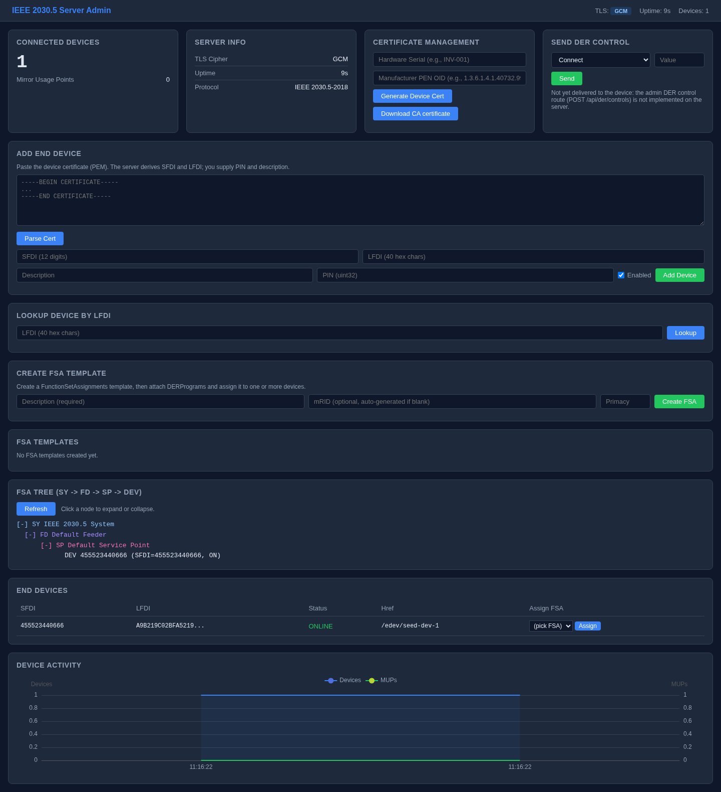

The cards render in this order:

### NavBar

The header strip: TLS mode, server uptime, and a live device count. All
three read "-" until the page's first data fetch resolves, then update
live as the server pushes updates every five seconds. A device count of
zero is a real, meaningful reading, not a placeholder waiting for data.


No corresponding IEEE 2030.5 resource; nothing here changes anything.

### Connected Devices (Overview)

A summary count of registered EndDevices and Mirror Usage Points (MUPs).

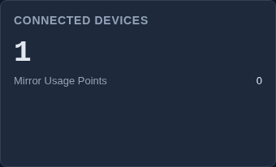

Corresponds to the EndDevice and MirrorUsagePoint resources. The count
shown here is a rollup, not a mutation surface; nothing on this card
changes server state. A MUP is created only by a device connecting over
the protocol listener, which this admin-only walkthrough never does, so a
freshly seeded system correctly shows zero MUPs here.

### Server Info

TLS cipher, server uptime, and a fixed protocol-version line. Nothing
here depends on any seeded data; it is populated as soon as the server
has been running a few seconds.

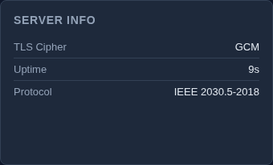

No corresponding IEEE 2030.5 resource; informational only, nothing to
change.

### Certificate Management

Two states. The bare form:

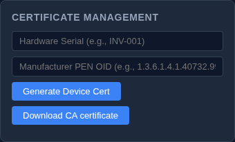

And the state after filling in a hardware serial and manufacturer PEN OID
(here, `CAPTURE-DEMO-CERT-01` and `1.3.6.1.4.1.40732.99`) and clicking
**Generate Device Cert**:

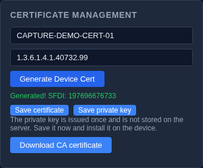

This calls `POST /api/certs/device` and mints a new device certificate,
offered as **Save certificate** / **Save private key** downloads. The
private key is never written into the page itself, only offered through
the download button; downloading the CA certificate (`GET /api/certs/ca`)
is a separate, read-only action on this same card. There is no button
here, or anywhere in the UI, to mint a server certificate or an admin
certificate: `admin.md`'s
[Certificate downloads](admin.md#certificate-downloads) section explains
why the server-cert route is CLI-only by design.

Corresponds to the device certificate material behind EndDevice
registration; nothing in the admin-authorization mechanism.

### Send DER Control

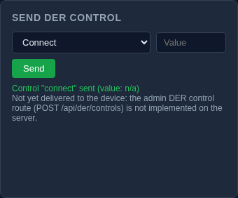

This card does not send anything. Choosing a control and clicking Send
updates the result line to read something like `Control "connect" sent
(value: n/a)`, but the click never reaches the network: there is no
`POST /api/der/controls` route on the server, and the panel's own submit
handler only echoes your selection back into its result line.
`admin.md`'s feature table already lists this row "In Progress" for the
same reason. Treat this card as a preview of a planned feature, not a
working control, and do not expect a device to react to anything sent
from it.

### Add End Device

Covered in full in Part 1 above: paste a certificate, parse it, fill in
the remaining fields, and register the device.


Corresponds to the EndDevice resource (creation) and its Registration
record. Mutating: `POST /api/certs/info` (parse, read-only against the
store) and `POST /api/devices` (create).

### Lookup Device by LFDI

Also covered in Part 1: type an LFDI, click Lookup, and read either a hit
or a miss.


Corresponds to an EndDevice lookup by LFDI. Read-only; nothing here
mutates anything.

### Create FSA Template

Type a description and click **Create FSA**.

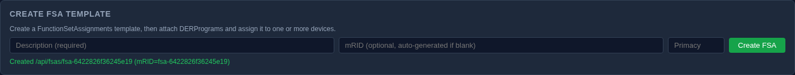

The result line reports the created template, for example `Created
/api/fsas/fsa-6422826f36245e19 (mRID=fsa-6422826f36245e19)`. The
description field clears itself on success, so the result line, not the
form, is the evidence the create worked.

Corresponds to a FunctionSetAssignments (FSA) template. Mutating:
`POST /api/fsas`.

### FSA Templates (catalog)

A table of every FSA template created so far, each row showing its
attached DER programs and any devices assigned to it.

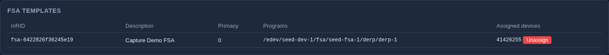

An empty catalog reads "No FSA templates created yet"; a populated row
shows a non-placeholder Programs column and a device chip with an
Unassign button once at least one device is assigned to that template.

Corresponds to the list of FunctionSetAssignments templates. Mutating:
`DELETE /api/devices/{id}/fsa-assignment` (unassign, via the button
already visible on an assigned row).

### FSA Tree

A tree view of the same FSA templates, their attached DER programs, and
the devices assigned to each, rendered with every level expanded by
default.

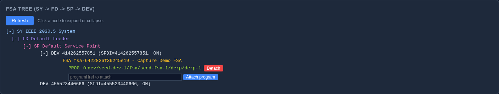

Corresponds to the FunctionSetAssignments / DERProgram / EndDevice
hierarchy. An inline "attach program" input and, at the top level, a
Delete button are always visible once any FSA template exists; they are
not hidden behind a click. Mutating: attach/detach DER programs
(`POST`/`DELETE .../programs`) and delete an FSA template
(`DELETE /api/fsas/{id}`).

### End Devices (table)

Every registered EndDevice, its status, its LFDI (truncated for display),
and, if any FSA template exists, an "Assign FSA" control per row.

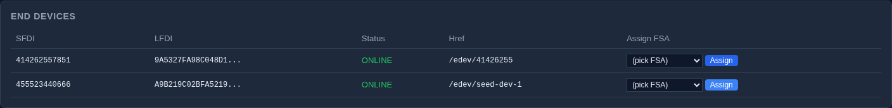

An empty table reads "No devices registered"; a populated table shows
each device as `ONLINE` or otherwise, with its LFDI shown as the first 16
characters plus `...`.

Corresponds to the EndDevice resource list. Mutating:
`POST /api/devices/{id}/fsa-assignment` (assign, via the row's own
select and button).

### Device Activity (chart)

A rolling chart of device (and MUP) counts over time, drawn from the same
five-second update stream the NavBar and Overview cards use.

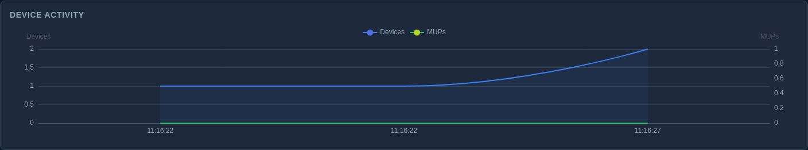
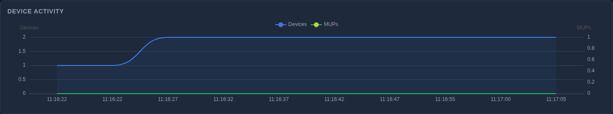

Do not judge this chart by a fixed wait time. The chart's legibility
tracks *data changing*, not *time elapsed*: a step in device count becomes
a visible curve within a few update ticks of it happening, and every tick
after that with no further change just extends a flat line without adding
anything to look at. The practical guidance is to wait for the device or
MUP count to actually change, then give it roughly 10 to 15 seconds: that
is enough time for the step to render as a curve rather than a single
point. Waiting longer than that on an otherwise-idle system does not
produce a better chart.

No corresponding IEEE 2030.5 resource directly; it visualizes EndDevice
and MirrorUsagePoint counts over time. Nothing on this card mutates
anything.

### Admin Login (conditional)

This card has two distinct appearances, and only one of them is shown
here. The standalone login page, served at `GET /login` independent of
the dashboard, appears when you are not yet authenticated:

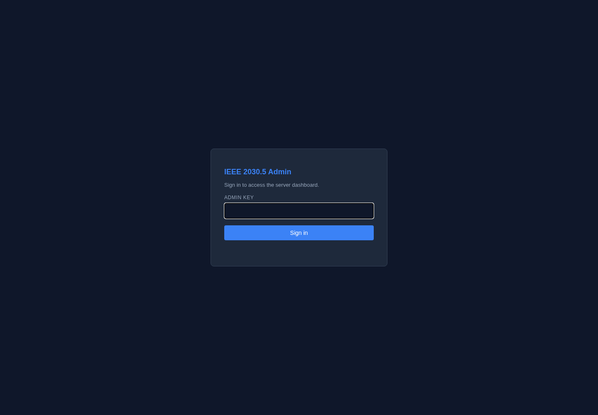

A second appearance exists in the code: the same login form rendered
*inside* the dashboard shell, in place of the panel grid, when an
already-open dashboard tab's session expires or is invalidated while the
tab stays open. That state could not be produced against this
walkthrough's loopback server: on loopback, with no reverse-proxy header
present, every request is admitted by the `#246` bypass before any
session check runs, so the dashboard's own probe never receives the
failure that would trigger it. Reproducing it needs either a
non-loopback admin bind or a request routed through a proxy that injects
the forwarded-for header `admin.md` describes.

No corresponding IEEE 2030.5 resource; this is the admin-plane session
mechanism, and it is unrelated to device identity (SFDI/LFDI). Mutating:
`POST /auth/login` (a session, not domain data).

## Known limitations

- **The admin listener's mTLS path has no supported way to trust a private
  certificate authority today.** `buildAdminTLSConfig`
  (`internal/server/server.go:597-609`) never sets `ClientCAs`, so a
  client certificate presented to the admin listener is verified against
  the system's default trust store, not any CA you generate yourself. A
  certificate signed by a CA you control, including one produced by
  `sep2server certs generate-admin`, fails the TLS handshake before the
  admin policy OID is ever checked. This is tracked at
  [GRIDAPPSD/ieee-2030_5-server-go#418](https://github.com/GRIDAPPSD/ieee-2030_5-server-go/issues/418).
  Until it is resolved, reach the admin plane over the loopback bypass,
  the Bearer token, or the login-cookie session, as described in
  `admin.md`.
- **Send DER Control does not send anything.** See its section above; the
  card is a UI preview of a feature that has no backend route yet.
- **The SPA-embedded login state was not captured** and could not be
  produced in a loopback test environment, for the reason given in its
  section above.
- **No screenshot here shows a nonzero Mirror Usage Point count.** Seeding
  one requires a device connecting over the protocol listener rather than
  anything reachable from the admin API, which is outside what this guide
  covers.
